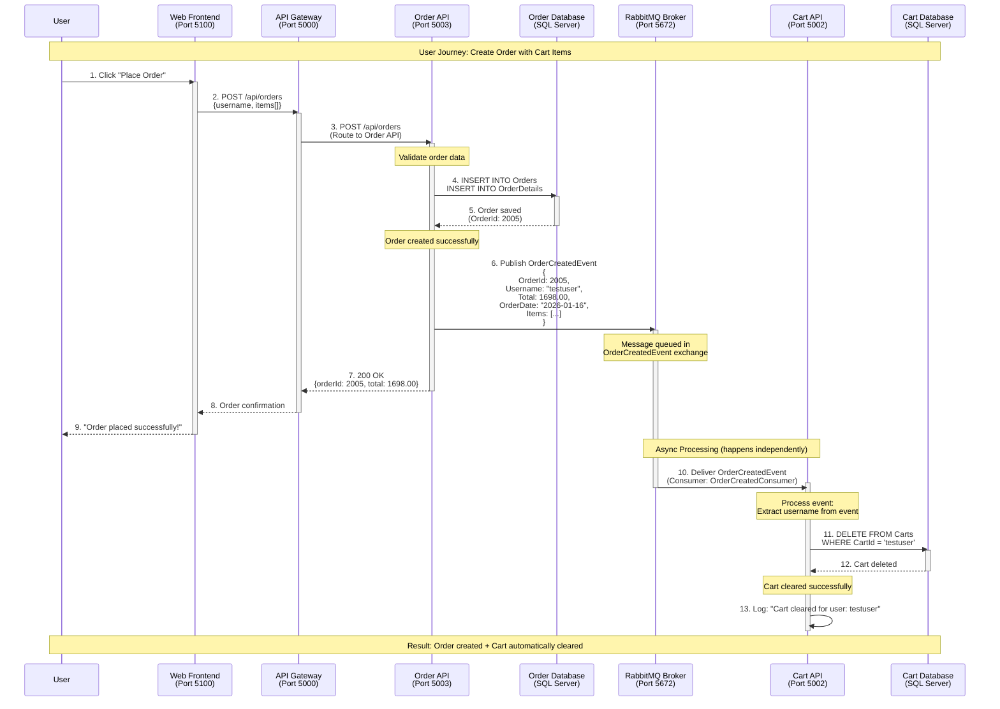
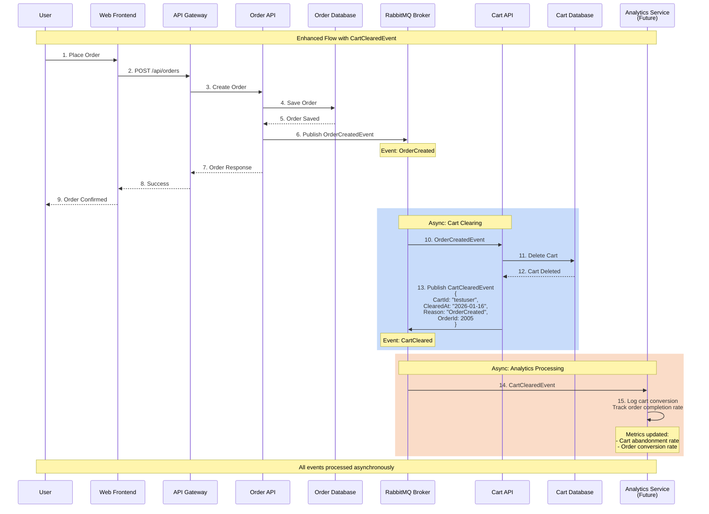
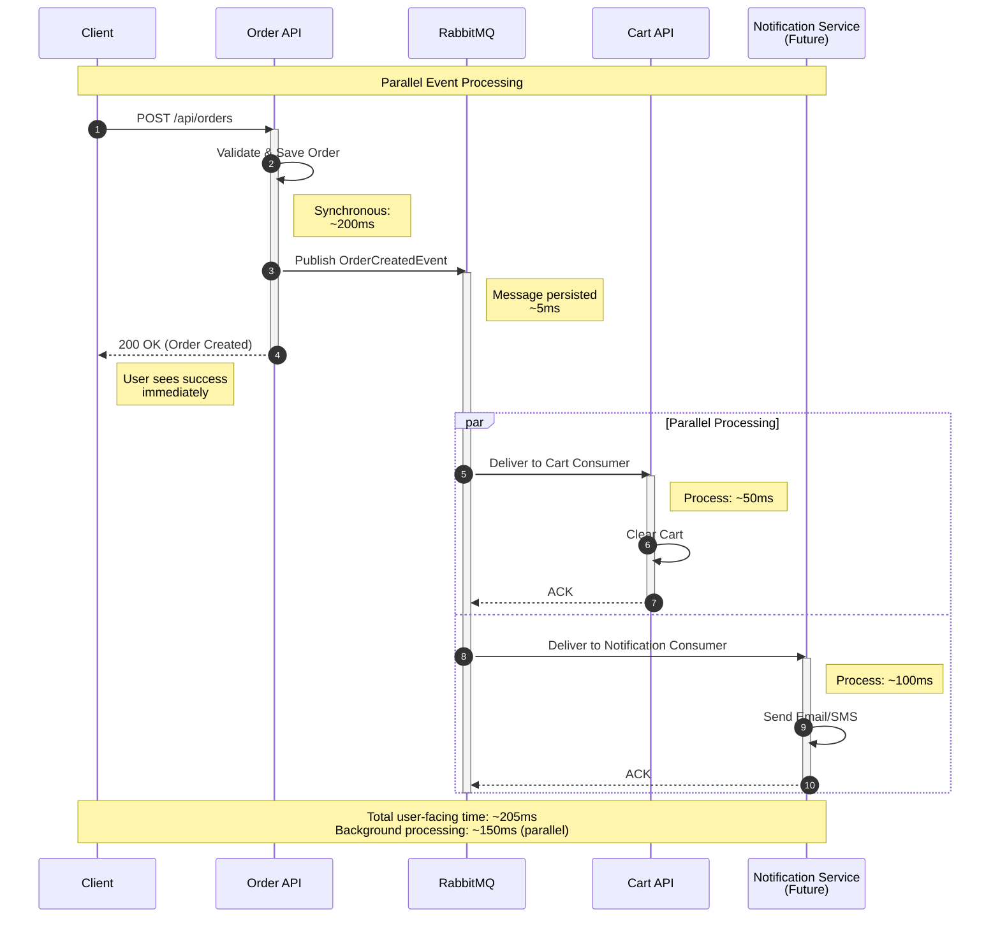
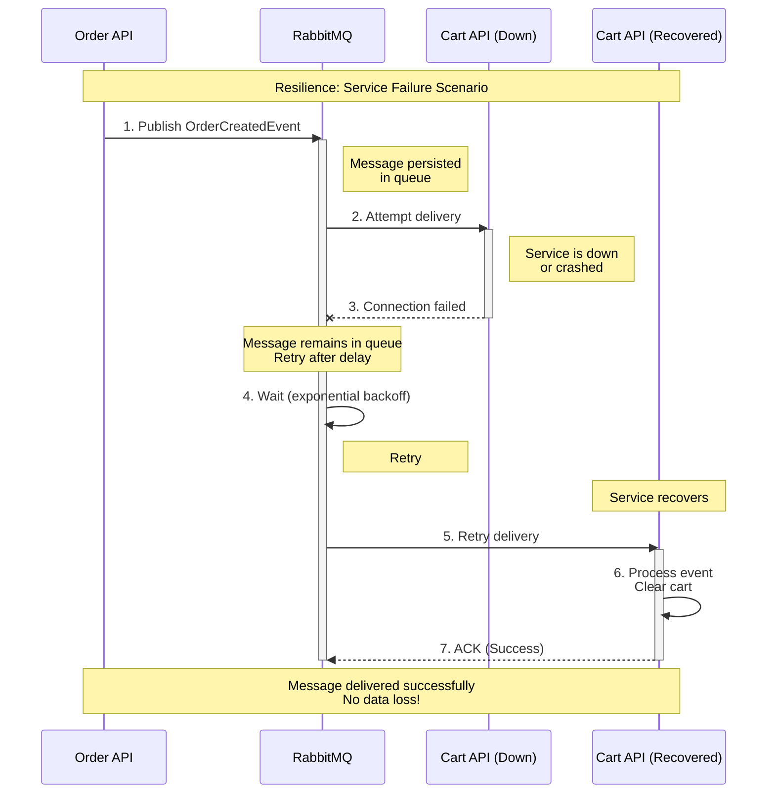
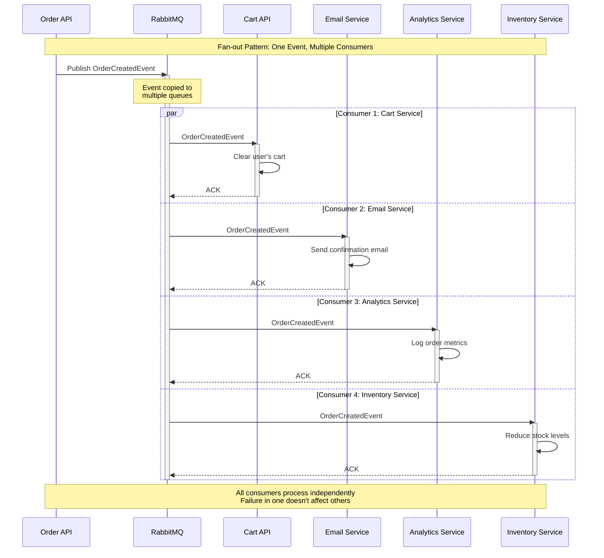

# Async Messaging Sequence Diagrams

## 1. OrderCreated Event - Cart Auto-Clear Flow

This diagram shows the complete flow of creating an order and automatically clearing the cart through RabbitMQ async messaging.



---

## 2. Complete Flow with Cart Cleared Event (Future Enhancement)

This diagram shows the enhanced flow including the CartClearedEvent for audit/analytics purposes.



---

## 3. Detailed Event Flow with Timing

This diagram shows the timing and parallel processing nature of async events.



---

## 4. Error Handling and Retry Flow

This diagram shows how RabbitMQ handles failures and retries.



---

## 5. Multiple Consumers Pattern

This diagram shows how multiple services can consume the same event.



---

## Key Benefits Illustrated

### 1. **Decoupling**
- Order API doesn't know about Cart API
- Services can be deployed independently
- Easy to add new consumers without changing publishers

### 2. **Resilience**
- Messages persist in RabbitMQ if consumer is down
- Automatic retry with exponential backoff
- No data loss even during service failures

### 3. **Scalability**
- Multiple consumers can process events in parallel
- Can add more consumer instances for load balancing
- Horizontal scaling without code changes

### 4. **Performance**
- User gets immediate response (synchronous part)
- Heavy processing happens asynchronously
- Better user experience with faster response times

---

## Event Schemas

### OrderCreatedEvent
```json
{
  "orderId": 2005,
  "username": "testuser",
  "total": 1698.00,
  "orderDate": "2026-01-16T06:07:27",
  "items": [
    {
      "productId": 1,
      "quantity": 1,
      "unitPrice": 699.00
    },
    {
      "productId": 2,
      "quantity": 1,
      "unitPrice": 999.00
    }
  ],
  "customerInfo": {
    "firstName": "Test",
    "lastName": "User",
    "email": "test@example.com",
    "phone": "555-0123"
  }
}
```

### CartClearedEvent (Planned)
```json
{
  "cartId": "testuser",
  "clearedAt": "2026-01-16T06:07:30",
  "reason": "OrderCreated",
  "orderId": 2005,
  "itemCount": 2
}
```

---

## Testing the Flow

### Test Script
```powershell
# Run the async messaging test
cd GadgetsOnlineWebForms/microservices
.\test-async-messaging.ps1
```

### Expected Output
1. Cart has 2 items
2. Order created (ID: 2005)
3. Wait 3 seconds for async processing
4. Cart is empty (cleared automatically)

### Verify in RabbitMQ UI
- URL: http://localhost:15672
- Username: guest
- Password: guest
- Check "Queues" tab for message activity
- Check "Exchanges" tab for OrderCreatedEvent

