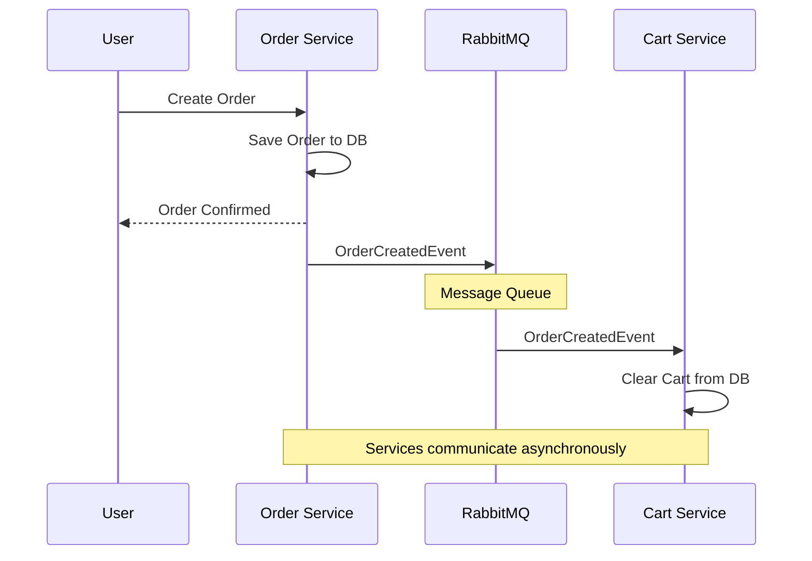
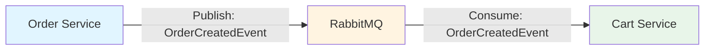

# Simple Async Messaging Diagram

## High-Level: Order → Cart Async Communication

---

## Even Simpler: Component View

---

## Flow Summary

1. **Order Service** creates order → publishes event to RabbitMQ
2. **RabbitMQ** stores and delivers the event
3. **Cart Service** receives event → clears the cart

**Key Point:** Services don't talk directly to each other - they communicate through RabbitMQ messages.
